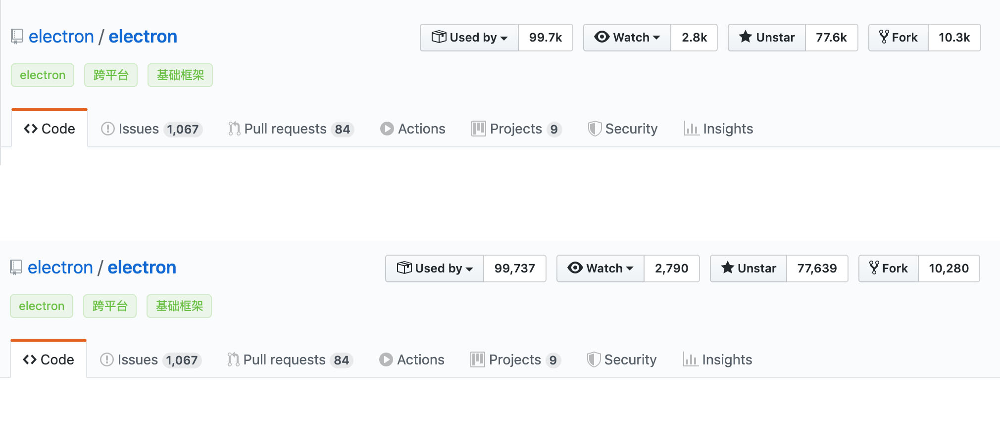
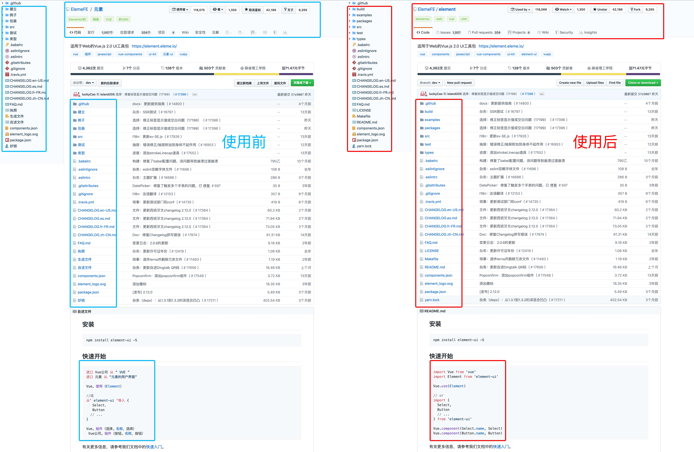
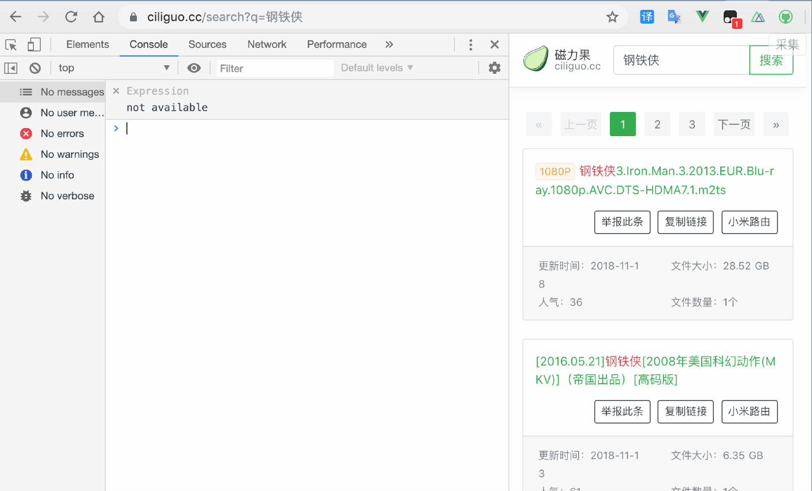

* [Tampermonkey](http://www.tampermonkey.net/)
* [GreasyFork](https://greasyfork.org/zh-CN)

## Github显示具体Star数字
将顶栏的数字缩写转换为具体数字

>[github_number.js](github_number.js)
>
>GreasyFork：[https://greasyfork.org/zh-CN/scripts/391285](https://greasyfork.org/zh-CN/scripts/391285)

## 谷歌翻译绕过代码块
让谷歌翻译插件翻译网页的时候绕过代码块和一些无需翻译的元素
>[translation_bypass.js](translation_bypass.js)
>
>GreasyFork：[https://greasyfork.org/zh-CN/scripts/392357](https://greasyfork.org/zh-CN/scripts/392357)

## 磁力搜自动采集
添加一个采集按钮到页面右上角，执行自动采集解析规则的操作
>[magnetw_xpath.js](magnetw_xpath.js)
>
>GreasyFork：[https://greasyfork.org/zh-CN/scripts/392361](https://greasyfork.org/zh-CN/scripts/392361)

## 直播平台自动网页全屏
进入直播间后自动点击网页全屏按钮

>[auto\_live_fullscreen.js](auto_live_fullscreen.js)
>
>GreasyFork：[https://greasyfork.org/zh-CN/scripts/377547](https://greasyfork.org/zh-CN/scripts/377547)
